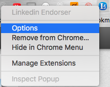
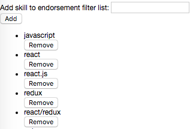

## Chrome extension - Linkedin Endorser

** Disclaimer: Linkedin might disable the ability on one machine to endorse skills if you heavily rely on this extension in a short period of time. **

### Background

It's App Academy job hunting season! This Chrome Extension can let you endorse your classmates just in one click!

### Functionality & MVP

With this extension, users will be able to:

- [ ] Endorse all the skills for your friend.
- [ ] Has an option to create a skill list you want to endorse for your friend.

### Screenshots

#### Option Menu

#### Option Settings

#### After toggle Linkedin Endorser.

### Technologies & Technical Challenges

Use Page action and DOM to access skill buttons in Linkedin user profile page.
Compare the skills with the preset skill list and endorse the one matches the list.
